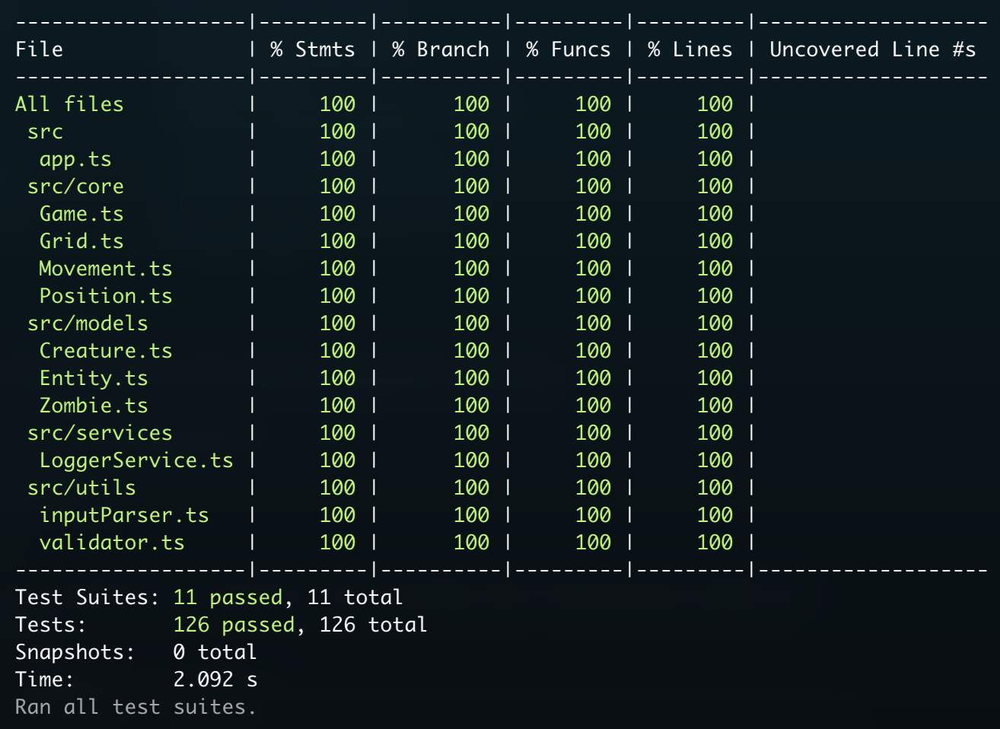

# Zombie Apocalypse Game

This is a command-line simulation game which simulate zombie behaviours in a post nuclear war environment.

This game is being build by the following requirements:

- The game world is a grid of size N × N.
- The simulation starts with one zombie at a given initial position.
- The grid contains one or more creatures located at different positions.
- A zombie can move across the grid, wrapping around when reaching the edges (e.g., moving right from the last column brings the zombie to the first column).
- When a zombie moves to a position occupied by a creature, that creature becomes infected and instantly turns into a new zombie.
- Newly infected zombies will also follow the same move sequence, one after another, until all zombies complete their moves.
- The game ends when no zombies have moves left.

## 👤 Author: George (Kalok) Cheung

## 💡 Design and Assumptions

### Object-Oriented Programming Principles

This solution leverages OOP principles for clean, maintainable code:

- **Encapsulation**: Private data in Grid, Position, and Game classes with controlled public interfaces
- **Abstraction**: Abstract Entity class and IObserver interface hide implementation details
- **Inheritance**: Zombie and Creature inherit from Entity, sharing common properties and methods
- **Polymorphism**: Different entity types can be treated uniformly as Entity instances

### Design Patterns Used

- **Factory Pattern**: Game class manages entity creation
- **Singleton Pattern**: Ensures single LoggerService instance via `getInstance()`
- **Observer Pattern**: Decouples game events from logging through `IGameObserver` interface

### Key Assumptions

1. Creatures become zombies immediately upon contact
2. Multiple zombies and creatures can occupy the same cell

## 📝 Code Quality

- ESLint is configured for code linting
- Prettier is used for code formatting
- Husky is set up for pre-commit hooks

## 📋 Prerequisites

- Node.js (Latest LTS version recommended)
- npm (comes with Node.js)

## 🛠️ Installation

1. Clone the repository:

```bash
git clone https://github.com/KarlokZhang/Zombie-Apocalypse-Game.git
cd zombie-apocalypse-game
```

2. Install dependencies:

```bash
npm install
```

## 🚀 Key Available Scripts

- `npm run start` - Start the game
- `npm run test` - Run Jest tests
- `npm run test:coverage` - Run Jest tests with coverage
- `npm run lint` - Run ESLint to check code quality
- `npm run type-check` - Run TypeScript type checking
- `npm run format` - Format code using Prettier
- `npm run format:check` - Check code formatting
- `npm run test` - Run Jest tests
- `npm run verify` - Run all checks (lint, type-check, test, format)

## 🏗️ Project Structure

```
zombie-apocalypse-game/
├── src/
│   ├── app.ts                # Main application entry point
│   ├── constants/            # Game constants
│   ├── core/                 # Core game engine
│   │   ├── Game.ts           # Main game controller
│   │   ├── Grid.ts           # Grid management
│   │   ├── Position.ts       # Position handling
│   │   └── Entities/         # Game entities (Zombie, Creature)
│   ├── interfaces/           # Interfaces
│   ├── services/             # Services (Logger)
│   └── utils/                # Utility functions
├── __tests__/                # Test files
├── index.ts                  # Main entry to start the app
├── package.json              # Project dependencies
├── tsconfig.json             # TypeScript configuration
├── jest.config.js            # Jest test configuration
└── README.md                 # This file
```

## 🧪 Testing

The project uses both Jest for unit testing ntegration testing:

1. Unit tests for all core components
2. 100% test coverage
3. Input validation test
4. Error handling

> The focus was on reliability, isolation, and coverage while maintaining speed and developer ergonomics.

- Unit tests are located in `src/test/`

### Test Results


